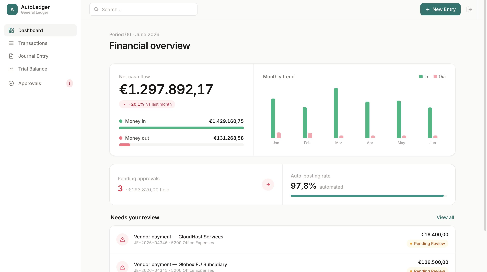
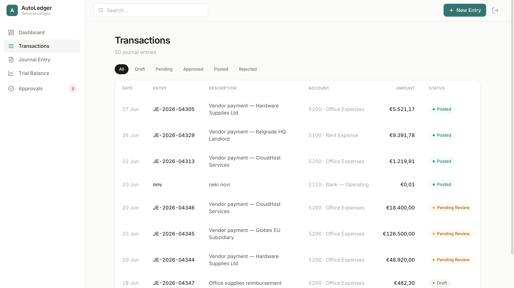
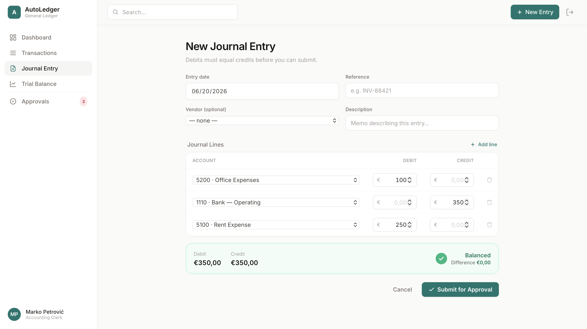
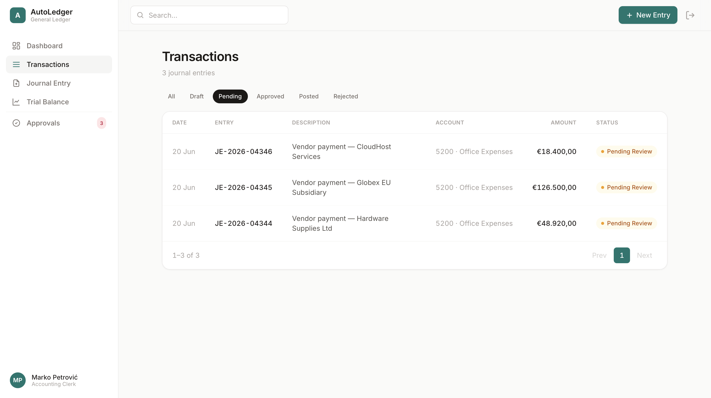
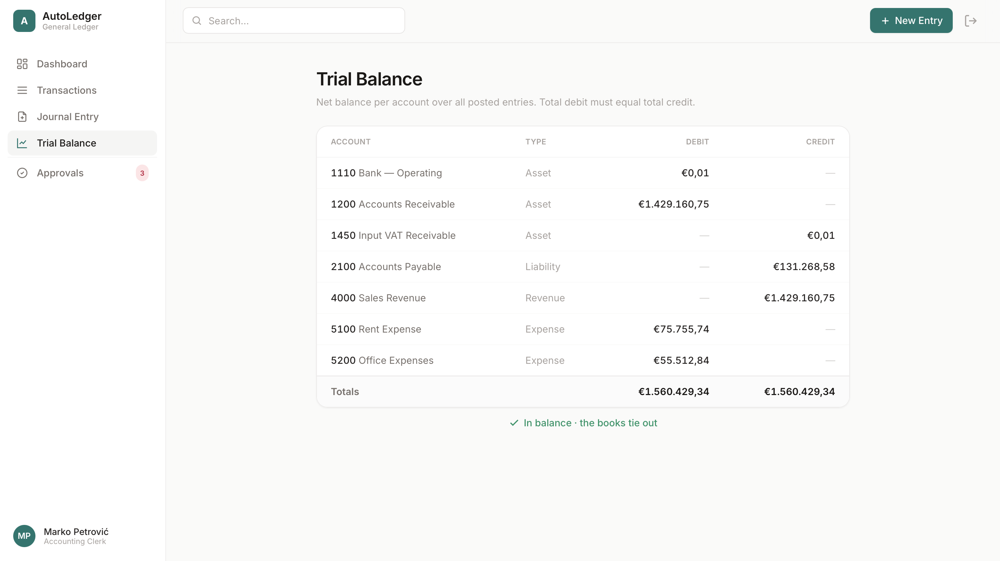

# AutoLedger

A B2B ERP-style **General Ledger** with an automated **risk-approval workflow**, built to demonstrate
production-grade .NET: layered architecture, design patterns, complex SQL, and a containerised
deploy pipeline.

Every new transaction is risk-scored on submission. Low-risk entries are auto-approved and posted;
risky ones are routed to a controller for manual approval. The ledger enforces double-entry
bookkeeping (debits must equal credits) and posted entries are immutable for audit integrity.

## 🔗 Live demo

**▶︎ [autoledger.fly.dev](https://autoledger.fly.dev)** — no setup required.

On the sign-in page click **“Sign in as Controller”** (can approve/reject) or **“Sign in as Clerk”**
(creates entries), or use:

| Role | Email | Password |
|------|-------|----------|
| **Controller** | `controller@autoledger.local` | `Passw0rd!` |
| **Clerk** | `clerk@autoledger.local` | `Passw0rd!` |

**Worth a look:** the **Dashboard** (cash-flow chart + KPIs), **Transactions** (filter by status),
opening a *Pending Review* entry to **Approve/Post or Reject** (Controller only), the **New Journal
Entry** form (live debit = credit balancing), and **Trial Balance** (the books tie out).

> First request may take a few seconds — the machine cold-starts from idle to keep hosting free.

## 📸 Screenshots

**Dashboard** — net cash flow, monthly income/expense trend, KPIs (pending approvals, auto-posting rate) and a "needs your review" queue.



**Transactions** — paginated grid, filterable by status (Draft / Pending / Approved / Posted / Rejected).



**New Journal Entry** — double-entry form with live debit = credit balancing; submit stays disabled until the entry balances.



**Review & approval** — a flagged entry with its risk score and line detail; a Controller can Approve & Post or Reject.



**Trial Balance** — per-account net balances proving total debit equals total credit.



> The original design blueprint and the static UI mockups it was built from live in [`design/`](design/).

## Tech stack

- **.NET 9** · ASP.NET Core MVC (Razor views) · C#
- **Entity Framework Core 9** · **PostgreSQL** (Npgsql)
- **ASP.NET Core Identity** with roles (`Clerk`, `Controller`)
- **Tailwind CSS** (compiled, no CDN)
- **Docker** / Docker Compose · **Fly.io** · GitHub Actions CI/CD
- **xUnit** tests

## Architecture (three layers, mapped to the job spec)

```
src/
  AutoLedger.Domain          Business objects + logic — no infrastructure dependencies
    Entities/  Enums/  States/ (State pattern)  Risk/ (Strategy pattern)
    Services/ (PostingService, RiskAssessmentService, WorkflowEngine)  Abstractions/
  AutoLedger.Infrastructure  Data access — EF Core, repositories, raw-SQL queries, audit interceptor, Identity
  AutoLedger.Web             Presentation — controllers, Razor views/partials, view components
tests/
  AutoLedger.Tests           xUnit: double-entry, state machine, risk strategies, posting/rollback
```

Dependencies point inward: `Web → Infrastructure → Domain`. Repository/query interfaces live in
`Domain`; EF implementations live in `Infrastructure` (Dependency Inversion).

### Design patterns

- **State pattern** (`Domain/States`) — each status (`Draft`, `PendingReview`, `Approved`, `Posted`,
  `Rejected`) is a class that permits only its legal transitions; illegal ones throw. No `switch`.
- **Strategy pattern** (`Domain/Risk`) — interchangeable `IRiskStrategy` rules (vendor-average
  deviation, cold-start payee, large-amount ceiling) combined by `RiskAssessmentService`.
- **Unit of Work / explicit transaction** (`PostingService`) — posting runs inside
  `BeginTransaction → Commit/Rollback`, so a failed write never leaves a half-posted ledger (ACID).
- **Optimistic concurrency** — PostgreSQL's `xmin` system column is the row-version token, so two
  controllers can't approve the same entry over each other.
- **Audit trail** — an EF Core `SaveChanges` interceptor records every change (including status
  transitions, e.g. `PendingReview → Posted`) with the acting user, automatically.

### Complex SQL (`Infrastructure/Queries`)

1. **Trial Balance** — joins lines + accounts, `GROUP BY` account, `CASE WHEN` to place each net
   balance on the correct debit/credit side; total debit must equal total credit.
2. **Cash Flow** — income vs expense bucketed by month (`date_trunc`) for the dashboard chart.
3. **Vendor risk statistics** — `AVG` + `STDDEV_POP` over a vendor's prior posted entries, feeding
   the deviation risk strategy.

## Running locally (Docker only — nothing to install)

```bash
docker compose up --build
```

Then open <http://localhost:8080>. The database is migrated and seeded automatically on startup
(chart of accounts, vendors, ~80 journal entries across statuses and months).

**Demo accounts** (or use the one-click buttons on the sign-in page):

| Role | Email | Password |
|------|-------|----------|
| Controller (can approve/reject) | `controller@autoledger.local` | `Passw0rd!` |
| Clerk (creates entries) | `clerk@autoledger.local` | `Passw0rd!` |

### Common tasks (all via the .NET SDK container — no local SDK needed)

```bash
# run tests
docker run --rm -v "$PWD":/src -w /src mcr.microsoft.com/dotnet/sdk:9.0 dotnet test

# add a migration
docker run --rm -v "$PWD":/src -w /src mcr.microsoft.com/dotnet/sdk:9.0 \
  bash -c "dotnet tool restore && dotnet ef migrations add <Name> \
    --project src/AutoLedger.Infrastructure --startup-project src/AutoLedger.Infrastructure"

# rebuild the Tailwind stylesheet
docker run --rm -v "$PWD":/src -w /src/src/AutoLedger.Web node:20-alpine \
  npx -y tailwindcss@3.4.17 -i ./Styles/app.css -o ./wwwroot/css/site.css --minify
```

## Deploying to Fly.io

```bash
fly launch --no-deploy        # uses the included fly.toml + Dockerfile
fly postgres create           # provision a database
fly postgres attach <db-app>  # injects DATABASE_URL (read automatically at startup)
fly deploy
```

Pushing to `main` runs the GitHub Actions workflow (build → test → `flyctl deploy`); set the
`FLY_API_TOKEN` repository secret to enable the deploy step.
